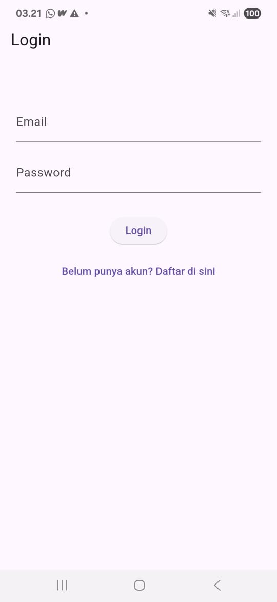
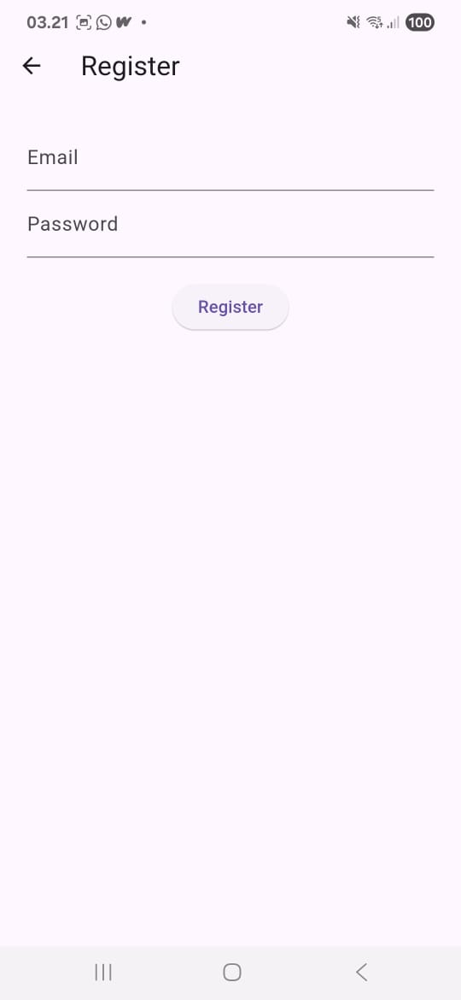
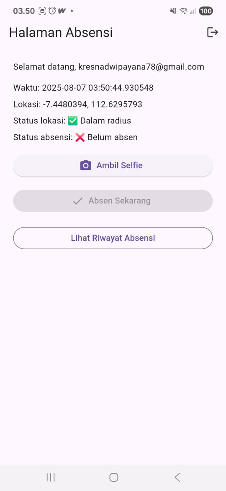
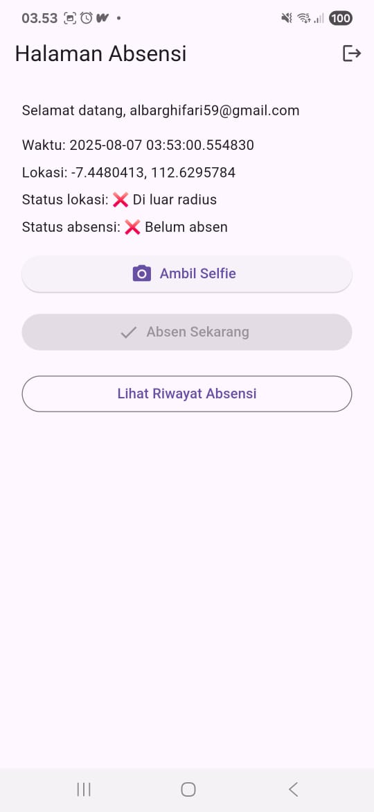
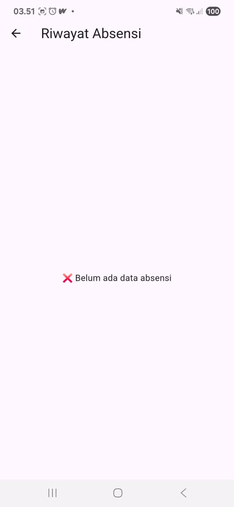
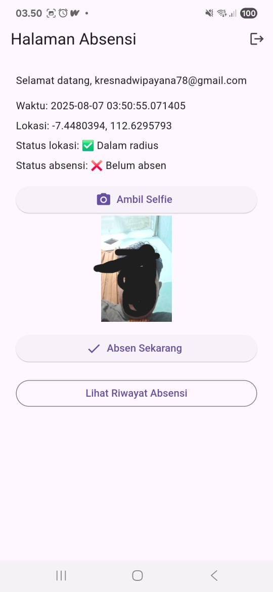
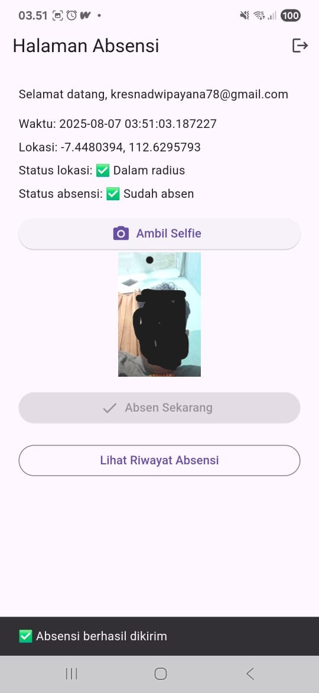
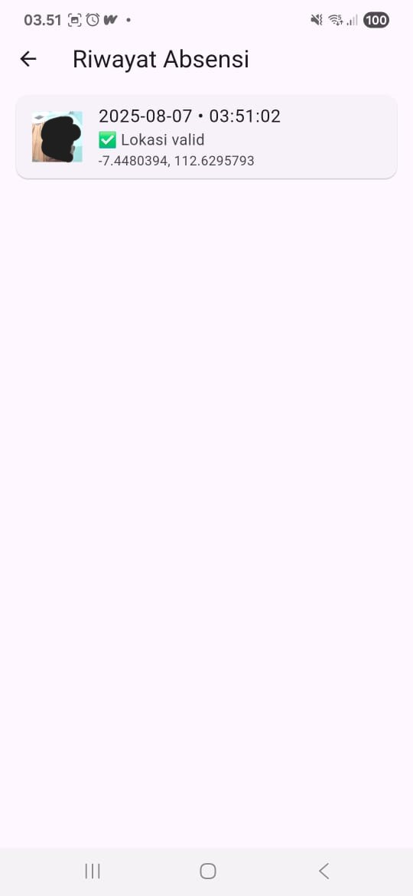
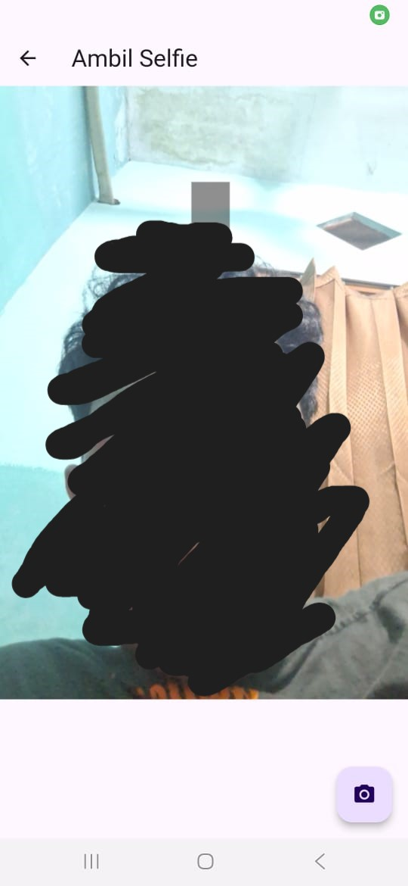

# 📸 Absensi Selfie App

Aplikasi Flutter sederhana untuk melakukan absensi berbasis **lokasi dan selfie**, menggunakan:

- 📍 Geolocator untuk validasi radius lokasi
- 📸 Kamera untuk selfie
- 🔥 Firebase Authentication & Firestore (tanpa Firebase Storage)
- 🧠 Penyimpanan foto dilakukan di memori lokal perangkat

---

## ✨ Fitur Utama

- Login & Register menggunakan Firebase Auth
- Validasi lokasi (radius 100 meter dari kantor)
- Ambil selfie menggunakan kamera HP
- Cek status apakah sudah absen hari ini
- Riwayat absensi per user
- Logout & multi-user support

---

## 📱 Tampilan Antarmuka Aplikasi

| Login                           | Register                              | Home (Dalam Radius)                                |
| ------------------------------- | ------------------------------------- | -------------------------------------------------- |
|  |  |  |

| Home (Luar Radius)                               | Sebelum Absen                                  | Setelah Selfie                            |
| ------------------------------------------------ | ---------------------------------------------- | ----------------------------------------- |
|  |  |  |

| Setelah Absen                                | Riwayat Absensi                           | Ambil Selfie                           |
| -------------------------------------------- | ----------------------------------------- | -------------------------------------- |
|  |  |  |

---

## 🔐 Keamanan & Privasi

- 📸 **Selfie tidak diunggah ke cloud** — foto hanya disimpan **sementara di memori lokal perangkat** untuk ditampilkan di histori.
- 🛰️ Lokasi pengguna hanya diambil **saat melakukan absensi** dan langsung disimpan sebagai koordinat latitude/longitude.
- 🔐 Tidak ada data sensitif lain (IMEI, nomor HP, kontak, dll) yang dikumpulkan.
- 🔒 Hanya pengguna yang login yang bisa melihat dan mengakses riwayat absensinya sendiri.
- ❌ Tidak ada penggunaan Firebase Storage untuk mencegah biaya dan menjaga privasi gambar.

## 📝 Catatan Tambahan

- ⏰ Pengguna hanya dapat absen **satu kali per hari**.
- 📌 Tombol "Absen Sekarang" hanya aktif jika:
  - Lokasi berada di dalam radius kantor
  - Sudah mengambil selfie
  - Belum absen hari ini
- 🧭 Radius kantor ditentukan dalam `location_service.dart` (default: 100 meter).
- 🖼️ Riwayat absensi menampilkan gambar lokal; jika file selfie tidak ditemukan, ditampilkan ikon fallback.
- 🔍 Untuk menampilkan riwayat, aplikasi melakukan query dengan index gabungan `user_id` + `timestamp`. Pastikan composite index sudah dibuat di Firestore.

## 🛠️ Teknologi yang Digunakan

| Teknologi       | Keterangan                                  |
|----------------|----------------------------------------------|
| Flutter         | Framework utama UI                          |
| Firebase Auth   | Login/register pengguna                     |
| Cloud Firestore | Penyimpanan data absensi                   |
| Geolocator      | Ambil lokasi & validasi radius             |
| Camera          | Ambil foto selfie dari kamera              |

---
